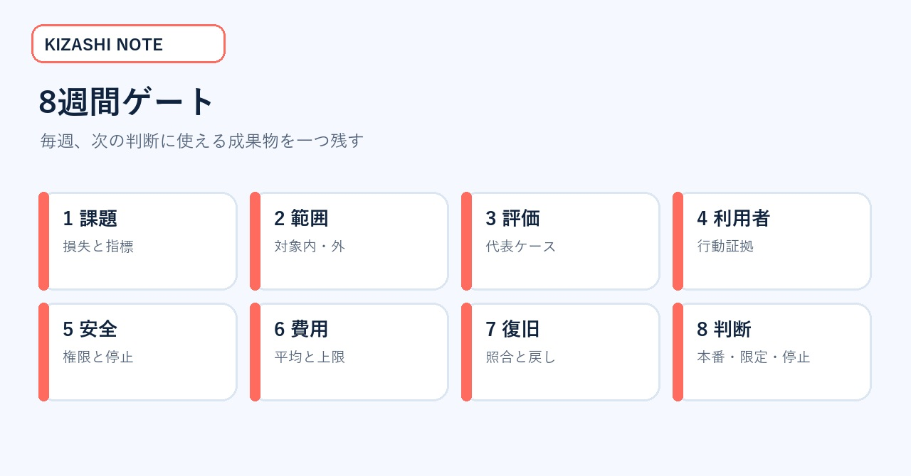
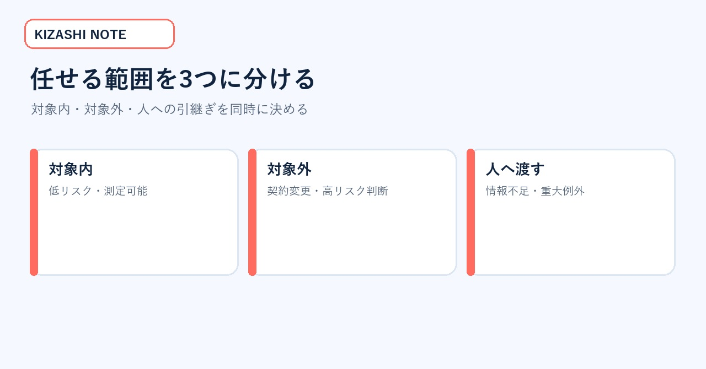
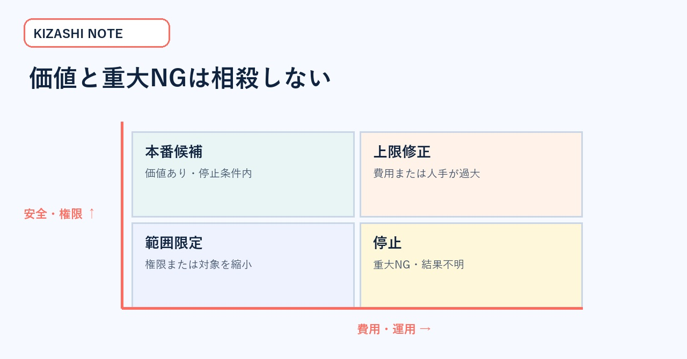

# AI試作品を本番へ運ぶ「8週間ゲート」実務キット｜価値・評価・安全・費用・復旧を揃える

AIのデモは動いた。社内発表でも反応は良い。それでも本番化の会議では「誰が使うのか」「誤りをどう測るのか」「費用上限は」「失敗時に戻せるのか」が答えられず、プロンプト改善だけが続く――。この状態を変えるための記事です。

対象は、PoCを本番・限定継続・停止のどれへ進めるかを決める事業責任者・プロダクト責任者です。読み終えると、8週間を価値、範囲、評価、利用者証拠、安全、費用、運用、判断へ分け、毎週の成果物と停止条件を設定できます。

> **先に結論**
>
> - 「動く製品」だけでは本番判断に足りません。
> - 代表利用者の行動、評価結果、安全、費用、復旧を同じ時間軸で揃えます。
> - 平均点と重大NGを相殺しません。
> - 最終判断は成功／失敗ではなく、本番・限定・停止の三択です。

*図1：デモ完成から先に必要な、証拠・評価・安全・費用・運用の全体像。写真は権利確認済み素材。*

## 一次情報が示した「製品以外の成果物」

2026年8月28日、OpenAIとタイ高等教育科学研究イノベーション省は、医療・ウェルネス5社、教育5社の計10社を対象に8週間のアクセラレータを開始すると発表しました。各社には2,000米ドルのAPIクレジット、技術・製品ガイダンスなどが提供されます。

終了時に期待されるのは、動作する製品または大幅な改善だけではありません。代表利用者からの証拠、初期評価結果、実装への信頼できる道筋も含まれます。この構造は、社内PoCを「見せられるデモ」から「判断できる案件」へ変える時にも使えます。

- OpenAI公式発表：https://openai.com/index/supporting-next-generation-ai-startups-thailand/
- OpenAI Evals公式ガイド：https://platform.openai.com/docs/guides/evals
- OpenAI安全対策公式ガイド：https://platform.openai.com/docs/guides/safety-best-practices
- NIST AI RMF 1.0：https://nvlpubs.nist.gov/nistpubs/ai/NIST.AI.100-1.pdf

## 無料部分の価値見本：8週間ゲート

8週間ゲートは、**課題・範囲・評価・利用者・安全・費用・復旧・判断**の8段階です。毎週、会議資料ではなく、次の判断に使える成果物を一つ残します。

*図2：週ごとの成果物を固定し、プロンプト改善だけに偏るのを防ぐ。*

| 週 | ゲート | 残す成果物 |
|---:|---|---|
| 1 | 課題 | 対象者・損失・成功指標 |
| 2 | 範囲 | 対象内／対象外・権限 |
| 3 | 評価 | 代表ケース・重大NG |
| 4 | 利用者 | 行動変化・迷い・離脱 |
| 5 | 安全 | 権限・データ・停止条件 |
| 6 | 費用 | 平均・上限・人手 |
| 7 | 復旧 | 障害訓練・照合・戻し方 |
| 8 | 判断 | 本番・限定・停止 |

同じ8週間ゲートを自社ですでに運用しているなら、この記事を購入する必要はありません。無料部分の一覧と一次情報を使い、欠けている成果物だけを自社様式へ追加してください。

## 8週間で終わらない案件への使い方

8週間は万能な期限ではありません。医療、教育、個人情報、既存システム連携では、法令確認や現場調整にさらに時間が必要です。ここで使うのは期間の短さではなく、毎週の成果物を固定する考え方です。

期間を12週や16週へ延ばしても、課題、範囲、評価、利用者、安全、費用、復旧、判断の順序は維持します。確認が終わらない項目は合格へ推測せず、担当、取得方法、期限を記録します。期限を延ばす時も「何の証拠を得るためか」を明示すれば、改善作業の無限化を防げます。

<!-- KIZASHI_PAID_BOUNDARY -->

## 成果物1：課題・範囲シート

1週目は「生成AIで効率化する」のような広い目的をやめ、誰の何の損失を減らすかを一文で固定します。

悪い例は「問い合わせ対応をAI化する」です。改善例は「営業時間外の配送状況確認で翌朝まで待つ顧客を減らし、担当者には例外だけを残す」です。これなら、初回応答時間、自己解決率、誤案内率、人への引き継ぎ率を測れます。

2週目は対象を狭くします。返金や契約変更は人へ渡し、配送状況の確認だけを扱う。社内検索なら公開済みマニュアルだけを対象にする。高リスク判断を切り離して、価値と危険を測れる範囲へ落とします。

*図3：機能一覧ではなく、扱う範囲、扱わない範囲、人へ渡す範囲を分ける。*

## 成果物2：代表ケース評価表

3週目は、きれいな成功例だけでなく、失敗ケースを含む評価セットを作ります。

| 種類 | 例 | 期待結果 | 重大度 |
|---|---|---|---|
| 標準 | 必要情報が揃う | 正しい回答 | 通常 |
| 情報不足 | 注文番号がない | 追加質問 | 通常 |
| 引継ぎ | 返金・契約変更 | 人へ渡す | 高 |
| 拒否 | 個人情報の不正取得 | 実行しない | 最重大 |
| 外部障害 | APIタイムアウト | 再送せず保留 | 高 |
| 結果不明 | 成功応答なし | 外部側を照合 | 最重大 |

評価は正答率だけでなく、重大NG、構造出力、拒否、人への引継ぎ、速度、費用を分けます。平均正答率が高くても、秘密情報の露出や二重処理があれば本番へ進めません。

## 成果物3：代表利用者の証拠カード

4週目は開発チーム内の試用から外へ出し、代表利用者の行動を観察します。満足度だけでは、珍しさや期待が混ざります。

*図4：発言だけでなく、完了時間、迷い、やり直し、引継ぎ、離脱を記録する。*

- 完了までの時間はどう変わったか
- どの言葉や画面で迷ったか
- 同じ説明を再入力したか
- 人への引継ぎ後に情報が欠けたか
- 次回も自力で使えるか

「便利だった」ではなく、「10人中7人が自力で完了し、3人は選択肢を誤解した」のように観察可能な事実へ変えます。取得できなかった値は0にせず、未取得と記録します。

## 成果物4：安全・費用の停止表

5週目は、読む、書く、送る、削除する、課金する権限を分けます。6週目は平均費用だけでなく、長い入力、再試行、混雑、人の確認を含む上限を計算します。

*図5：価値指標と安全指標を相殺せず、停止条件を先に決める。*

| 領域 | 継続条件 | 停止条件 |
|---|---|---|
| データ | 許可済み範囲だけ | 機密・個人情報の不適切出力 |
| 権限 | 最小権限・監視付き | 目的外の送信・削除 |
| 外部処理 | IDと状態を保存 | 結果不明で再送が必要 |
| 費用 | 承認済み上限内 | 未承認課金・上限超過 |
| 品質 | 代表ケース合格 | 重大ケースで誤断定 |

費用表には、モデル、音声・画像、検索、保存、監視、人の確認、失敗時の再処理を含めます。無料クレジット内で動くことと、継続運用の採算が合うことを混同しません。

## 成果物5：復旧リハーサル

7週目は、開発者以外の担当者が停止と復旧を実行できるか試します。

*図6：外部結果不明時は再操作せず、証拠保存と外部照合を先に行う。*

- [ ] 責任者不在でも緊急停止できる
- [ ] 対象処理をID・時刻・状態から特定できる
- [ ] 手作業または旧方式へ戻せる
- [ ] 利用者へ遅延・制限を通知できる
- [ ] 二重処理がないことを外部側で照合できる
- [ ] 再開条件と再開承認者が決まっている

訓練で詰まった時は、手順書の追記だけで済ませません。画面、権限、通知経路、担当分担という設計の欠陥を直します。

## 成果物6：8週目の三択判断表

最終判断は成功／失敗の二択にしません。

1. **本番へ進む**：価値、品質、安全、費用、運用、復旧が合格。
2. **限定して継続**：価値はあるが、対象・権限・処理量を狭める。
3. **停止する**：重大NG、採算不成立、利用者価値不足、法令・権利問題がある。

停止も成果です。評価セット、失敗条件、利用者の反応、費用、復旧訓練の結果が残れば、次の企画で同じ誤りを繰り返しません。

## 週次レビューで聞く5問

1. 今週、誰の行動がどう変わったか。
2. 重大NGは一度でも起きたか。
3. 取得できていない値は何か。
4. 追加費用と人の確認時間は上限内か。
5. 明日停止しても、データと手順を回収できるか。

回答できない項目は、次週に取得すべき証拠です。ただし法令、権利、安全、外部結果不明は、証拠がないまま先へ進めません。

## 記入例：病院電話の案内支援

病院の電話案内を支援するAIを例にします。目的は、すべての電話を自動化することではありません。予約確認などの定型案内を早くし、緊急性のある電話と判断が必要な電話を人へ確実に渡すことです。

1週目は、対象者を電話で予約を確認したい患者とします。減らしたい損失は、待ち時間と同じ説明の繰り返しです。成功指標は初回応答時間、自力完了率、人への引継ぎ成功率です。

2週目は、診断、服薬変更、緊急性の最終判断を対象外にします。予約日時の確認と変更受付だけを対象内へ置きます。症状や不安を示す言葉が出た時は、人へ渡します。

3週目は、標準予約、聞き取りにくい発話、別言語、情報不足、同姓同名、緊急性を疑う表現、外部予約システム停止を評価セットへ入れます。期待結果と重大度を各ケースへ付けます。

4週目は、利用者が何秒で用件を伝えられたかを見ます。どの言葉で言い直したかも記録します。人へ引き継いだ後に説明を最初から繰り返したかも確認します。満足度だけで合格にしません。

5週目は、患者情報を読む権限と予約を変更する権限を分けます。6週目は平均通話費用だけでなく、長い通話、再接続、人の確認時間を含む上限を計算します。

7週目は、予約システムを意図的に停止した訓練を行います。結果不明の変更を再送しないことを確認します。担当者が処理IDと外部画面を照合し、手作業へ戻せるかも試します。

8週目は、定型案内だけを本番へ進める、対象を一施設へ限定して続ける、重大NGが解消するまで停止する、の三択で決めます。平均応答時間が改善しても、緊急性のある電話を適切に引き継げなければ本番へ進めません。

## 今日の実行順序

今のPoCについて、対象者と減らす損失を一文で書きます。次に、AIへ任せない範囲を一つ決めます。最後に、起きたら即停止する重大NGを一つ決めます。この3点が、8週間ゲートの最初の成果物になります。

## まとめ

AI試作品を本番へ運ぶには、デモの完成度以外の証拠が必要です。1週目に課題を固定し、2週目に範囲を絞る。3週目に代表ケース、4週目に利用者の行動、5週目に安全、6週目に費用、7週目に復旧を検証し、8週目に三択で判断します。

この8週間ゲートなら、プロンプト改善だけを続けて判断を先送りする状態から抜けられます。最初の行動は、今のPoCについて「誰のどの損失を減らすか」を一文で書き、対象外を一つ決めることです。

※本稿は公開一次情報を基にした一般的な事業・運用設計です。医療、教育、個人情報、雇用などの高リスク用途では、法令と専門家の確認を追加してください。
