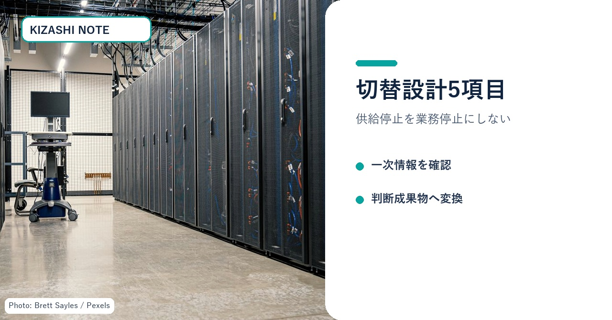
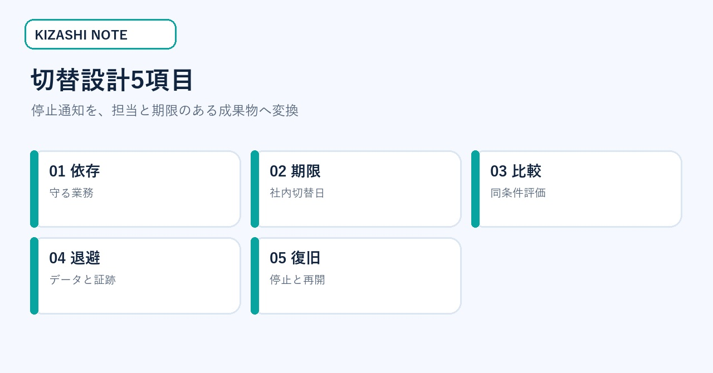
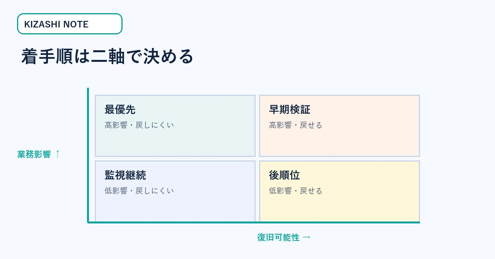
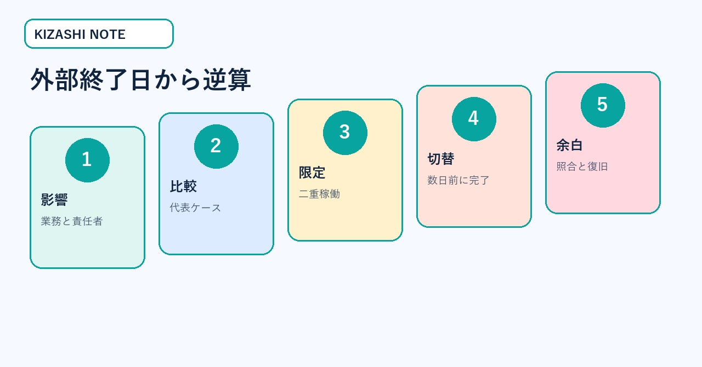
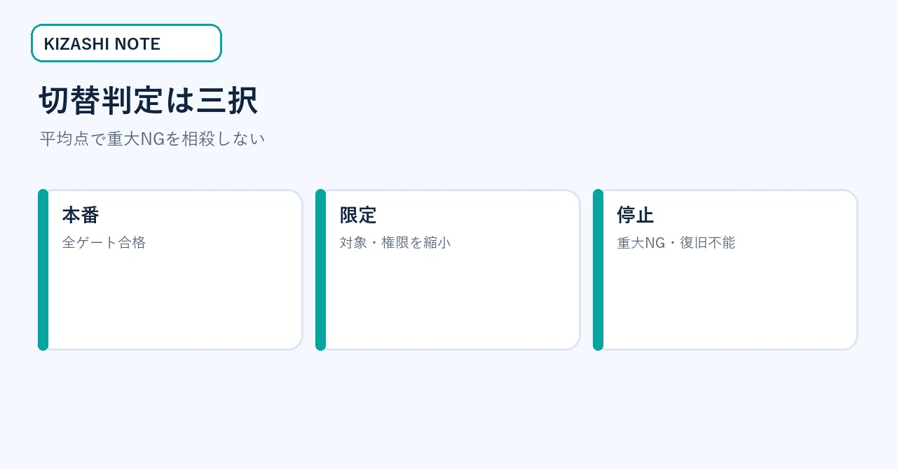
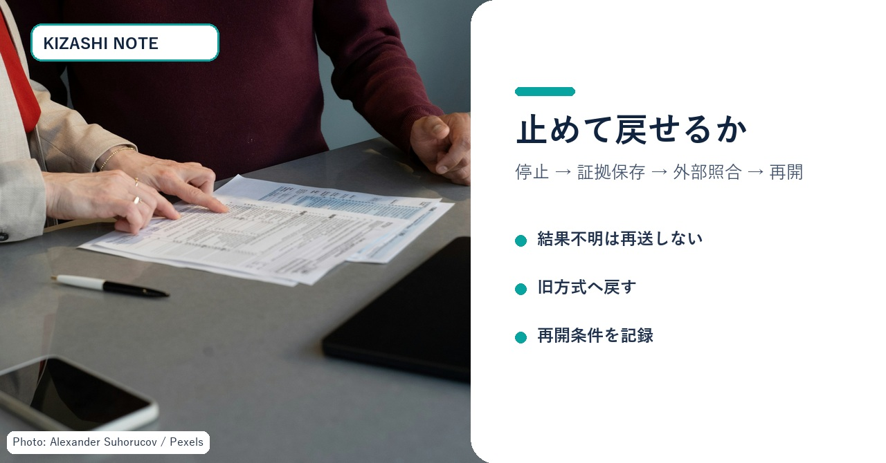

# AIモデル供給停止に備える「切替設計」実務キット｜期限から逆算する5つの成果物

社内で使うAIモデルの提供条件が変わり、移行期限だけが先に示された。ところが、担当者は「次にどのモデルを選ぶか」の比較から始め、業務側の依存、データ退避、切替判定、復旧手順が後回しになる――。この状態を変えるための記事です。

この記事の対象は、AIを業務や開発へ組み込み、停止通知を受けた時に社内の切替順序を決める情報システム責任者・開発責任者です。読み終えると、依存関係台帳、期限設計、同条件比較表、切替判定表、復旧チェックの5つを、その日の会議へ持ち込めます。

> **先に結論**
>
> - 先に選ぶのは代替モデルではなく、守る業務です。
> - 外部の終了日と社内の切替日を同じ日にしません。
> - 品質・費用・安全・復旧を、同じ代表ケースで比較します。
> - 外部結果が不明な処理は再送せず、照合してから再開します。

*図1：停止通知を「代替探し」ではなく、業務・期限・検証・復旧の設計へ変換する。写真は権利確認済み素材。*

## 一次情報で確定していること／していないこと

2026年8月28日、OpenAIはSpaceXに対し、CursorへOpenAIモデルを提供する契約を段階的に終了する意向を通知したと公表しました。提案された停止日は2026年11月12日で、契約上の最大通知期間を確保すると説明しています。また、将来のモデルをCursorへ提供しない方針も示しました。

ここから確定できるのは、OpenAI側が公表した意向・提案日・将来モデルの扱いです。一方、「すべてのCursor機能が同日に停止する」「すべての利用者が同じ影響を受ける」「代替先なら品質が維持される」とは、この発表だけでは言えません。利用機能、契約、プラン、地域、時点によって影響は変わります。

- OpenAI公式発表：https://openai.com/index/our-decision-on-cursor-following-its-acquisition-by-spacex/
- Cursor公式モデル案内：https://docs.cursor.com/advanced/models
- Cursor公式プライバシー案内：https://docs.cursor.com/account/privacy
- NIST AI RMF 1.0：https://nvlpubs.nist.gov/nistpubs/ai/NIST.AI.100-1.pdf

## 無料部分の価値見本：切替設計5項目

切替設計5項目は、**依存・期限・比較・退避・復旧**です。最初の会議では、この5列だけを埋めます。モデル名や評判から始めず、「止まった時に誰の何が止まるか」を一行で書くのが出発点です。

*図2：依存、期限、比較、退避、復旧を別の判断として扱う。*

| 項目 | 最初に決める問い | その場で出す成果物 |
|---|---|---|
| 依存 | 何の業務が止まるか | 依存関係台帳 |
| 期限 | いつまでに何を終えるか | 社内切替カレンダー |
| 比較 | 何を同条件で測るか | 代表ケース比較表 |
| 退避 | 終了後も何を確認するか | データ・証跡一覧 |
| 復旧 | 失敗時に誰が戻すか | 停止・復旧手順 |

同じ切替設計5項目を自社で運用済みなら、この記事を購入する必要はありません。無料部分で一次情報と全体像を確認し、自社台帳へ不足分だけ足してください。

## 読む前に集める4点

この記事を実務へ使う前に、現在の契約通知、利用機能一覧、直近30日の利用ログ、障害時の手作業手順を集めます。すべて揃わなくても始められますが、取得できないものは「なし」ではなく「未確認」と記録します。

担当者の記憶だけで台帳を埋めると、見えない連携や個人運用が抜けます。経理には請求と契約、情報システムには認証とログ、現場には停止時の代替作業を確認してください。4点を同じ場所へ置くだけで、最初の会議を推測合戦にせず、事実確認から始められます。

<!-- KIZASHI_PAID_BOUNDARY -->

## 成果物1：依存関係台帳

最初に作るのはツール一覧ではなく、業務単位の依存関係台帳です。利用回数が多い順ではなく、停止時の損失と復旧難度で並べます。

*図3：平均利用回数ではなく、影響範囲と復旧可能性の二軸で着手順を決める。*

| 業務 | 利用中のAI・API | 許容停止 | 手作業 | データ | 責任者 | 優先度 |
|---|---|---:|---|---|---|---|
| 問い合わせ分類 | モデル／ワークフロー | 4時間 | 可能 | 顧客文面・分類ログ | CS責任者 | 最優先 |
| コード補完 | IDE内モデル | 1営業日 | 可能 | リポジトリ・規約 | 開発責任者 | 高 |
| 契約文レビュー | 社内検索＋モデル | 即時 | 法務へ戻す | 契約・承認記録 | 法務責任者 | 最優先 |

空欄はゼロにせず「未確認」と書き、確認担当と期限を付けます。秘密情報の値は書かず、保管先、更新日、失効日、責任者だけを記録します。

## 成果物2：期限から逆算する切替カレンダー

外部終了日を社内切替日にすると、最後の不具合を直す余白がありません。社内切替、限定運用、二重稼働、評価セット確定を前倒しします。

*図4：外部終了日までに、調査・比較・限定運用・本切替・復旧余白を分ける。*

1. **影響確認**：業務と責任者を確定する。
2. **比較準備**：代表ケースと重大NGを固定する。
3. **限定運用**：一部利用者・一部処理で二重稼働する。
4. **社内切替**：外部終了日の数営業日前に切り替える。
5. **復旧余白**：ログ照合、訂正、未処理回収に使う。

期限の決め方は「作業日数＋承認日数＋復旧余白」です。契約・法務・セキュリティ確認がある場合は、そのリードタイムを開発作業と別に置きます。

## 成果物3：代表ケース比較表

互換APIでも、業務上の互換性は保証されません。同じ入力、同じ期待結果、同じ停止条件を使って比較します。

| 比較軸 | 測る値 | 合格条件 | 即停止条件 |
|---|---|---|---|
| 事実性 | 事実抜け・誤断定 | 重大事実の欠落0 | 顧客影響のある誤断定 |
| 構造 | JSON／項目形式 | 下流処理成功率99%以上 | 構造破損が連続 |
| 拒否 | 答えないべき例 | 人へ引継ぎ | 機密・個人情報を出力 |
| 速度 | p50／p95 | 業務SLA内 | タイムアウトで二重処理 |
| 費用 | 平均／上限 | 承認済み上限内 | 未承認課金・上限超過 |

代表ケースには、標準、難問、情報不足、人へ引き継ぐ例、外部障害、結果不明を含めます。平均点が高くても、重大NGを1件出した候補は合格にしません。

## 成果物4：切替判定表

切替判定は「新モデルの方が賢いか」ではなく、業務を安全に継続できるかで決めます。

*図5：平均点で重大NGを相殺せず、本番・限定・停止の三択へ落とす。*

- **本番へ進む**：品質、安全、費用、運用、復旧がすべて合格。
- **限定して進む**：価値はあるが、対象、権限、処理量を狭める必要がある。
- **停止する**：重大NG、法令・権利問題、未承認課金、復旧不能がある。

判定会議では「誰が」「どの証拠で」「いつ再判定するか」を記録します。「様子を見る」「検討する」は成果物にしません。

## 成果物5：停止・復旧チェック

移行の完成は、新経路が一度成功した時ではありません。失敗時に止め、外部側を照合し、旧経路または手作業へ戻せる時です。

*図6：外部結果が不明なら再送せず、停止・保存・照合・訂正・再開の順で進める。*

- [ ] 監視担当と緊急停止の連絡先が決まっている
- [ ] 外部結果不明時に自動再送しない
- [ ] 処理ID・時刻・対象・状態を秘密情報なしで残せる
- [ ] 旧経路または手作業へ戻せる
- [ ] 二重処理がないことを外部側で確認できる
- [ ] 再開条件と再開承認者が決まっている

## 30分会議の進め方

最初の10分で、公式通知、対象業務、現在の利用部署、契約担当を確認します。次の10分で、影響度と復旧難度を付けます。最後の10分で、担当、期限、次回の成果物を決めます。

会議後に残すのは議事録ではなく、更新済みの5成果物です。依存関係台帳、切替カレンダー、代表ケース比較表、切替判定表、停止・復旧チェックが一つずつ更新されていれば、次の通知にも使える運用資産になります。

## 記入例：問い合わせ要約を切り替える

顧客問い合わせをAIで要約し、担当者へ渡す業務を例にします。守る業務は「顧客の過去経緯を短時間で把握し、回答漏れを減らすこと」です。特定モデルを使い続けること自体を目的にしません。

依存関係台帳には、入力が顧客本文と注文履歴、出力が担当者向け要約、許容停止が1営業日、手作業が原文確認、責任者がCS責任者と記入します。個人情報を含むため、権限と保存先は最優先確認です。

代表ケースは、通常問い合わせ、複数注文、返金要求、攻撃的な文面、個人情報の訂正、情報不足を含めます。合格条件は、注文番号と希望内容の欠落がないことです。停止条件は、別顧客情報の混入、存在しない返金約束、処理結果不明時の二重登録です。

限定運用では、新旧の要約を同じ担当者へ見せます。正解を当てるだけでなく、原文へ戻った回数、修正時間、見落とし、引き継ぎのやり直しを記録します。新経路が速くても、重大情報の欠落があれば本番へ進めません。

切替日には、未処理キューをいったん止めます。外部側の処理IDと件数を照合し、重複がないことを確認してから新経路へ流します。結果が不明な件は再送せず、担当者が原文を確認します。

この例の要点は、モデル名が変わっても成果物が残ることです。業務、ケース、停止条件、復旧手順は次回の切替でも使えます。

## 今日の実行順序

最重要業務を一つ選び、依存関係台帳の一行目だけを書きます。次に、外部終了日ではなく社内切替日を仮置きします。最後に、重大NGを一つ決めます。この3点があれば、次回会議は候補探しではなく、比較と復旧の設計から始められます。

## まとめ

モデル供給や契約の変更そのものは利用者側で止められません。しかし、変更が業務停止へ直結するかは設計で変えられます。

代替モデルの人気比較より先に、守る業務を決める。外部終了日から社内切替日を逆算する。同じ代表ケースで品質・費用・安全を比較する。証跡を退避し、外部結果不明時の再送を止め、復旧経路を確認する。この切替設計5項目を運用できれば、今回だけでなく次の変更通知にも耐えられます。

最初の行動は、最重要業務を一つ選び、依存先・許容停止・手作業・責任者を一行で書くことです。

※本稿は公開一次情報を基にした一般的な業務設計です。契約、法務、個人情報、セキュリティは各社の担当者と確認してください。
